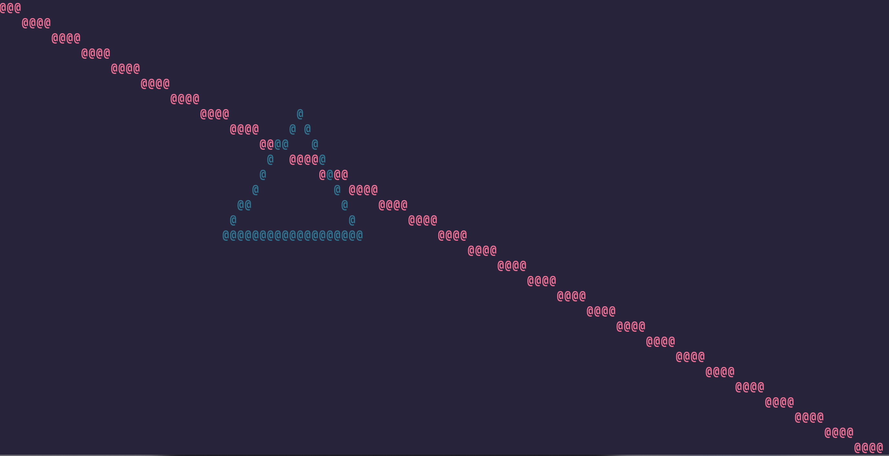

# Tgl

An open source simple terminal rendering library for c++.

## License

[MIT](https://choosealicense.com/licenses/mit/)

## Installation

Just include all the header files inside the `src/` directory except in the `internal/` folder (unless you know what you're doing).

## Usage/Examples

All the examples are inside the `examples/` directory.

Available examples:

- `Redline/`: A big red line rendered from top left ot bottom right,
  with a green triangle intersecting with the line.

## Screenshots

## Features

- draw pixel
- draw line
- draw rectangle
- swap buffers

## Acknowledgements

- [Readme.so](https://readme.so/editor)
- [Google style guide](https://google.github.io/styleguide/cppguide.html#Comments)
- [ANSI escape characters](https://gist.github.com/fnky/458719343aabd01cfb17a3a4f7296797)

## Authors

- [@aboudekahil](https://github.com/aboudekahil)
